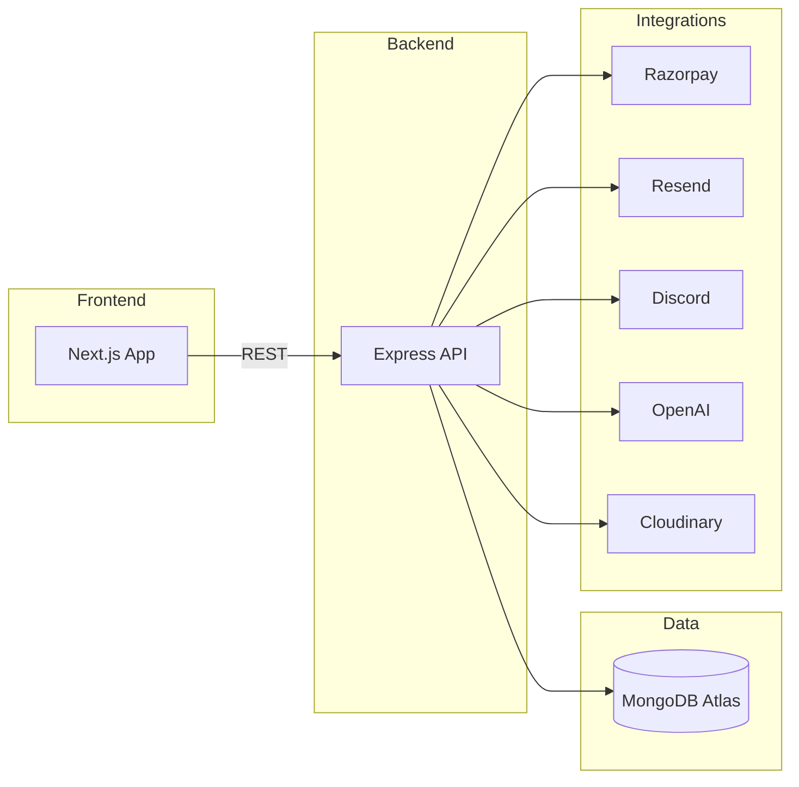

# Architecture

## Overview
- Frontend: Next.js 15 App Router (Vercel)
- Backend: Express + TypeScript (Render/Railway)
- Database: MongoDB Atlas
- Integrations: Razorpay, Resend, Discord, OpenAI, Cloudinary

## Diagram

